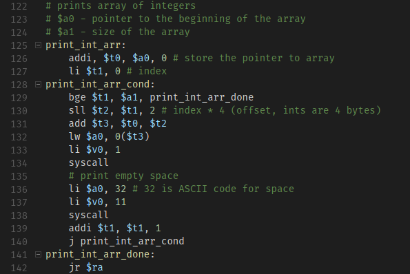
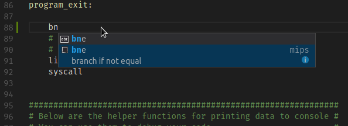

# MIPSY Support

MIPSY Support is a modified version of [vscode-mips-support](https://github.com/kdarkhan/vscode-mips-support) by [kdarkhan](https://github.com/kdarkhan) that adds support for the [mipsy](https://github.com/insou22/mipsy)-specific instructions `push`, `pop`, `begin` and `end`.

It also contains modified snippets designed to better suit using tab indentation with tab width set to 8 spaces.

The original readme of [vscode-mips-support](https://github.com/kdarkhan/vscode-mips-support) is below:

## TODO
- [ ] Modify snippets to better suit 8-space tab width indentation
- [ ] Fix typos in existing snippets
- [ ] Add missing comments to existing snippets
- [ ] Improve snippet naming
- [ ] Add snippets for MIPSY instructions
- [ ] Add better syntax highlighting for negative numbers

# MIPS Support

## Features
This VSCode extension provides basic MIPS colorization and snippets support.

### Colors

### Snippets

The extension is based on Textmate's [MIPS bundle](https://github.com/textmate/mips.tmbundle)

## Release Notes

### 0.0.9

* Add snippets for `xor`, `xori`, `slt`, and `slti`

### 0.0.8

* Add snippets for `and`, `andi`, `nor`, `or`, `ori`, `sll`, and `srl`

### 0.0.7

* Add highlighting for `subi`

### 0.0.6

* Syntax highlight $s8 register

### 0.0.5

* Add TLB related instructions and order/reorder highlighting

### 0.0.4

* Fix .globl highlighting

### 0.0.3

* Add subi instruction

### 0.0.2

* Add syntax for singly-quoted characters
* Switch svg logo to png

### 0.0.1

* Initial release
